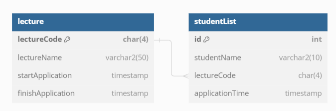

# 항해플러스 백엔드 두번째
## 요구사항 분석
- 특강 신청 API
    - userId로 선착순으로 제공되는 특강을 신청하는 API작성
    - 동일한 신청자는 한번의 수강 신청만 성공
        - 성공했고 다음에 같은 id로 요청이 올 때 실패
    - 특강은 특정 시간대에 열리고, 선착순 30명만 신청 가능
        - 시간이 아닌 때에 요청이 오면 실패
        - 30명이 초과 되었을 때 실패
- 특강 신청 완료 여부 조회 API
    - userId로 특강 신청 완료 여부를 조회하는 API를 작성
    - 명단을 조회하여 ID가 존재하면 성공했음을 반환, 명단에 없는 사람은 실패했음을 반환
    

## ERD
